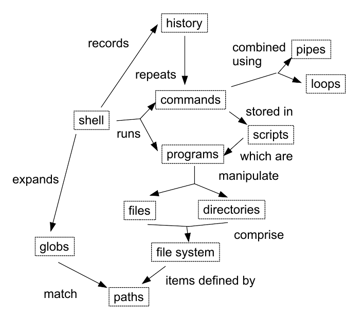

---
---
# Introduction to the Unix Shell for Data Science

*This document is a starting point for discussion of
what a new DataCamp course outline and development procedure might look like.
Feedback would be greatly appreciated.*

## Step 0: Learner Profiles

*Terms like "beginner" and "expert" mean different things to different people,
so these profiles make the course's intended audience concrete.
[Profiles typically have five parts][learner-profiles]:
the learner's general background,
what they already know,
what they think they want to do,
any special needs they might have,
and how the course will help them.*

*In production,
DataCamp will have a handful of stock profiles that define the first four points.
Particular course outlines will point to these and add the fifth.*

*Output: brief descriptions of intended audience.*

*Owner: curriculum leads (shared).*

**Jasmine**

1. Jasmine, 28, did a commerce degree at the University of North Carolina,
   and then an MBA at Georgia State.
   In the three years since completing it,
   she has been doing health insurance policy research for an underwriter.

2. Jasmine did a stats class as an undergrad
   and another in grad school (which covered almost exactly the same material).
   She uses Excel every day,
   and is comfortable doing simple operations in SAS.

3. Jasmine needs to improve her data analysis skills in order to make her next career move.
   Her manager is encouraging her,
   and has given her an afternoon a week to do online classes.
   She would also like to start teaching at her alma mater.

4. Jasmine is partially deaf,
   and strongly prefers written and visual material to spoken material.

5. This course will broaden Jasmine's computing knowledge
   so that she feels confident teaching others.

**Thanh**

1. Thanh, 35, has an undergraduate degree in psychology with a minor in statistics.
   He now works for the Quebec Ministry of Education,
   where he helps administer programs for children with learning disabilities.

2. Thanh uses classical statistical methods every day.
   He taught himself the basics of R,
   and then used DataCamp's courses to learn more.

3. Thanh is about to join a consortium that is analyzing different approaches to special education.
   As part of this,
   he wants to start building tools that other consortium members can use.

4. Thanh is fluent in Vietnamese and French,
   but only has high school English
   (supplemented by a solid technical vocabulary).

5. This course will show Thanh how to build command-line tools
   and use remote computing resources (such as clusters),
   and is a step toward building [robust software][robust-software].

## Step 1: Concept Map

*This is a brainstorming stage to determine what we want learners to know at the end of the course.
Its concrete output is usually a [concept map][concept-map] showing the main ideas and their relationships,
but in some cases it may be more productive to represent the learning as a map,
a [decision tree][abela-chart],
or some other form.*

*Output: graphical representation of learner's final mental model.*

*Owner: curriculum lead (per course).*



*Note:
it's tempting to write learning objectives at this point.
Resist!
Step 5 will almost certainly result in material being cut.*

## Step 2: Summative Assessment

*The best way to make the goal of a course concrete is
to present examples of what learners will be able to do at its end.
This is directly analogous to [test-driven development][tdd]:
rather than working forward from a (probably ambiguous) set of learning objectives,
designers work backward from the (concrete) final exam.*

*Output: 2-3 exercises that exercise all of the skills the learner is to develop.*

*Owner: curriculum lead.*

Question 1: you have several dozen data files, each of which is formatted like this:

```
2013-11-05,deer,5
2013-11-05,rabbit,22
2013-11-05,raccoon,7
2013-11-06,rabbit,19
2013-11-06,deer,2
2013-11-06,fox,1
2013-11-07,rabbit,18
2013-11-07,bear,1
```

Write a shell script called `unique.sh`
that takes any number of filenames as command-line parameters
and prints the names of the species found in each file
in alphabetical order.
Each file is processed separately.

> **Solution**
>
> ```
> #!/usr/bin/env bash
> 
> # Find unique species in CSV files where species is the second data
> # field.  This script accepts any number of filenames as arguments
> # and processes each separately.
> 
> for file in $@ 
> do
>   echo $file
>   cut -d , -f 2 $file | sort | uniq
> done
> ```

Question 2: the directory `./data` contains four CSV files and three shell scripts:

```
$ ls *.csv
autumn.csv	spring.csv	summer.csv	winter.csv

$ ls *.sh
first.sh	second.sh	third.sh
```

If the shell scripts contain the commands shown below,
what will be the output of:

1. `./first.sh *.*`
2. `./second.sh *.*`
3. `./third.sh *.*`

```
# first.sh
echo *.*
```

```
# second.sh
for filename in $1 $2 $3
do
  cat $filename
done
```

```
# third.sh
echo $@.csv
```

> **Solution**
>
> `first.sh` will display:
>
> ```
> autumn.csv first.sh second.sh spring.csv summer.csv third.sh winter.csv
> ```
>
> because `*.*` inside the script matches all two-part filenames,
> and the command-line arguments are ignored.
>
> `second.sh` will display the contents of `autumn.csv`, `spring.csv`, and `summer.csv`.
>
> `third.sh` will display:
>
> ```
> autumn.csv spring.csv summer.csv winter.csv.csv
> ```
>
> Note the double `.csv` at the end:
> the expression `$@` expands to the names of the command-line arguments,
> and then the explicit `.csv` in the script is tacked on.

## Step 3: Formative Assessments

*Formative assessments are exercises done while learning is taking place,
rather than at the end to determine whether it has.
Formative assessments serve two purposes:
to tell the learner and the instructor if the learner is making progress
(or conversely, what they still need to work on),
and to give the learner a chance to exercise the skills and knowledge
that will be needed in the summative assessment.*

*In order to create formative assessments,
course developers should work backward from the summative assessment written in Step 2.
Course developers should also attach times to each assessment
to show how long they think it will take learners to work through each one.*

*Output: 3-5 formative assessments for each hour of a lecture-based course.
(I don't yet know what to recommend for exercise-based courses like DataCamp's.)*

*Owner: course developer - these are the exercises that the learners do in the course.*

Formative assessments will be added here once this outline has been discussed
and the format improved.
Looking at the summative assessment,
these will need to cover:

- basic text manipulation commands (`cut`, `uniq`, `sort`)
- pipes
- loops
- creating and de-referencing variables
- shell scripts
- shell script parameters
- wildcard expansion (globbing)
- `ls`

The formative assessments for these will uncover other concepts:

- the current working directory
- paths
- text vs. binary files
- `cd`
- `mkdir`
- `rm`
- output redirection

Working backward in this way ensures that we only introduce
as much as we actually need to.

## Step 4: Sequencing

*In this stage,
formative assessments are put in a linear order that respects their dependencies.
This is the point at which course designers typically realize that they have too much material,
and debate amongst themselves what topics to cut.
It is important that they do **not** cut their initial time estimates for any particular exercise
to make everything fit,
as that quickly leads to Star Trek scheduling.*

*Output: an instructional sequence.*

*Owner: course developer (for sequence) and curriulum lead (to approve what gets cut off).*

A sequence and schedule will be added here once Step 3 has been completed.

## Step 5: Chapters

*At this point,
writing the actual chapters is straightforward:
each chapter simply adds what's needed for a particular formative assessment
to what's been taught to date.*

*This is also the point at which it's worth writing formal learning objectives.
Doing it earlier often wastes effort,
since material may be cut in Step 4.*

*Output: chapters (detailed point form or finished prose).*

*Owner: course developer.*

Chapters will be added here once the formative assessments have been sequenced.
Course developers will be strongly encouraged to keep each chapter very short
[[1][minimal-carroll],[2][minimal-lazonder],[3][minimal-ramsay]].

**Learning Objectives**

* Explain the similarities and differences between the Unix shell and graphical user interfaces.
* Demontrate fluency with core Unix commands.
* Explain what files and directories are.
* Match files and directories to relative and absolute paths.
* Predict the paths matched by wildcards and specify wildcards to match sets of paths.
* Combine programs using pipes to process large data sets.
* Write loops to process multiple files.
* Write shell scripts to automate repetitive tasks.

## Step 6: Course Description

*The course developer is now ready to work with the curriculum lead and marketing
to write a short blurb for the course
to be posted on the DataCamp website
and included in announcements.
The course's prerequisites should also be specified at this point.*

*Output: course blurb.*

*Owner: all.*

The Unix command line has survived and thrived for almost fifty years
because it lets people to do complex things with just a few keystrokes.
Sometimes called "the duct tape of programming",
it helps users combine existing programs in new ways,
automate repetitive tasks,
and run programs on clusters and clouds
that may be halfway around the world.
This course will introduce its key elements
and show you how to use them efficiently.

Prerequisites: none.

## Conclusion

Thirty years ago,
[Parnas and Clements pointed out][parnas-clements] wrote:

> Many have sought a software design process that allows a program to be derived systematically
> from a precise statement of requirements.
> It is proposed that,
> although designing a real product in that way will not be successful,
> it is possible to produce documentation that makes it appear that the software was designed by such a process.

The same is true of courses:
this process is described as a one-way flow,
but in practice,
course developers will loop back repeatedly
as each stage informs them of something they've overlooked or don't need in a previous stage.
With practice,
though,
those loops become tighter and more productive.

[abela-chart]: http://extremepresentation.typepad.com/.shared/image.html?/photos/uncategorized/choosing_a_good_chart.jpg
[concept-map]: http://third-bit.com/teaching/memory.html#concept-maps
[learner-profiles]: http://third-bit.com/teaching/lessons.html#learner-profiles
[minimal-carroll]: http://dl.acm.org/citation.cfm?id=1455726
[minimal-lazonder]: https://research.utwente.nl/en/publications/the-minimal-manual-is-less-really-more
[minimal-ramsay]: https://link.springer.com/article/10.1007/BF00119657
[parnas-clements]: http://ieeexplore.ieee.org/document/6312940/
[robust-software]: http://journals.plos.org/ploscompbiol/article?id=10.1371/journal.pcbi.1005412
[tdd]: https://en.wikipedia.org/wiki/Test-driven_development
